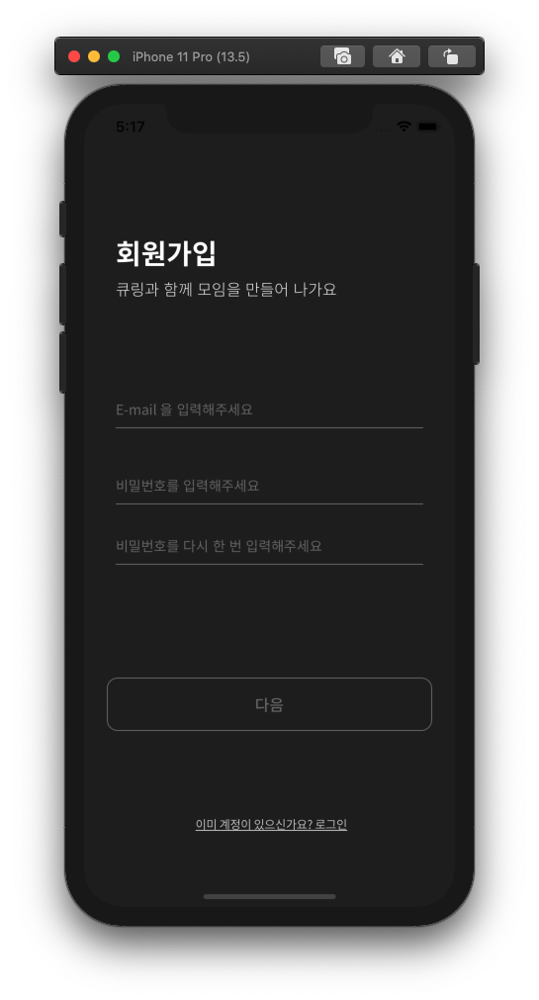

# qring-iOS

🐬 <kbd>QR코드</kbd>로 만들어가는 우리의 모임 🐬

모임의 시작과 끝을 함께하는, QRing입니다. 🐬 
QR 코드를 통해 모임의 시작을 빠르게, 모임의 끝엔 원활한 피드백을 통해 모임이 더 성숙해지고, 구성원은 함께 성장하게 됩니다.

<div>
  <kbd>
    
  </kbd>
</div>
<br>

* 목차

  * 컨벤션

    * [Code](#Code-Convention)

    * [Git](#Git-Convention)

    * [폴더구조](#폴더구조)

  * [프로젝트 소개](#프로젝트-소개)
    * 개발환경 및 라이브러리
    * 실행화면설명
    * 기능별 개발여부, 담당자
    * 어려운기능 소개, 새롭게알게된것
    * 팀원역할


<br>

***

***


## Code Convention

> 기능 함수화

* ViewDidLoad에 직접작성하는 코드 최소화


<br>

> 네이밍

* 기능과 관련된 네이밍

* UpperCamelCase

  * 타입
  * identifier

* lowerCamelcase

  * 변수
  * 함수

  


<br>

> Identifier 및 String 관리

* Cell
  * Cell 안에 static 변수로
* VC, Storyboard
  * 타입값으로
  * ex) `VC.main` 
* Asset
  * 타입값으로
  * ex) `AssetImg.home`


<br>

>프로그래밍

* `IBOutlet` 는위에 일반 변수, 상수들은 아래에
* 함수위치 순서는 쓰는 곳과 가까이에
  * override함수는 위쪽에
  * IBAction는 아래쪽에
* 해당VC에 관련한 extension은 같은파일에 작성
  * 해당 extension에서 각 protocol에 맞는 함수만 구현하기
* 각 함수구현후 1줄 개행
* 클로저 사용아닌이상 `self`사용 지양
* 코드가 한줄을 넘기지않도록 구현
  * 함수 프로퍼티단위로 개행
  * 배열 요소단위로 개행


<br>


## Git Convention

Git Project를 사용해서 진행상황 공유

<br>

>  주기

* 하루에 1번 Merge

<br>

>  브랜치

<div>
  
</div>


* <kbd>master</kbd>
  * <kbd>develop</kbd>
    * <kbd>feature</kbd>: 기능개발
      * `feature/기능이름`
    * <kbd>docs</kbd>: 문서작성
    * <kbd>release</kbd>: 배포버전
      * `release/배포버전`

<br>


> 커밋메시지

```
UPDATE - 기능 구현시
FIX - 버그 발견시
RELEASE - 버전 배포시
DELETE - 기능 삭제시
DOCS - 문서 편집시
```

ex) `UPDATE: #이슈번호 구현내용`

<br>


## 폴더구조

* Root
  * Screen
    * 각 화면
      * Views
        * Cell
        * Storyboard
          * `storyboard파일`
        * `VC파일`
      * Service 
        * Protocol
          * `protocol파일`
        * `Imp파일`
      * Model
        * `Model파일`
      * View 
        * `CustomView파일`
  * Network
    * `URL파일`
    * `responseModel파일`
    * `DependencyPool파일`
  * GlobalExtension
    * `extension파일`
  * Helper
    * `Name파일`
    * `Manager파일` - SingleTon관리
  * Support
    * `.plist파일`
    * `AppDelegate파일`
    * `Asset파일`
    * `폰트파일`


<br>

***

***

  

<br>

# 프로젝트 소개


<br>

## 개발환경 및 라이브러리

### 개발환경

Xcode <kbd>11.5</kbd>

CocoaPods <kbd>1.9.1</kbd>


### 라이브러리

* [Then](https://github.com/devxoul/Then) - <kbd>2.7.0</kbd>
* [Socket.IO](https://github.com/socketio/socket.io-client-swift) - <kbd>15.2.0</kbd>
* [SnapKit](https://github.com/SnapKit/SnapKit) - <kbd>5.0.1</kbd>
* [Kingfisher](https://github.com/onevcat/Kingfisher/wiki/Installation-Guide) - <kbd>5.14.0</kbd>
* [Charts](https://github.com/danielgindi/Charts) - <kbd>3.5.0</kbd>
* [Alamofire](https://github.com/Alamofire/Alamofire) - <kbd>5.2.1</kbd>
* [Cosmos](https://github.com/evgenyneu/Cosmos) - <kbd>22.1</kbd>
* [lottie](https://github.com/airbnb/lottie-ios-ios) - <kbd>3.1.8</kbd>


<br>

## 실행화면 설명

> ### Slash

<div>
	<kbd>
		
	</kbd>
</div>

<br>

> ### Login

<br>

<div>
	<kbd>
		
		
		
	</kbd>
</div>

<br>

> ### Home

<div>
	<kbd>
		
		
		
	</kbd>
</div>


* 내가 생성한 모임이 없을 경우, 큐알뷰와 '내 모임' 라벨 밑에 있는 컬렉션 뷰에 임피티 뷰가 출력됩니다.
* 내 모임을 생성하면 가장 최근 모임 불러오기 api를 통해 큐알 뷰에 해당 모임의 정보를 출력하여 큐알 뷰에 출력합니다. 
* 내 모임 라벨 밑 컬렉션 뷰에는 모임리스트 탭의 메인 화면과 동일한 현재 내가 만든 모임 리스트가 출력됩니다.
* 모임시간 1시간 전을 타이머로 확인하여 모임 시작 1시간 전이 되면 큐알뷰의 크기가 확대됩니다.   


<br>

> ### CreateMeeting

<div>
	<kbd>
		
		
		
	</kbd>
</div>

<div>
	<kbd>
		
		
		
	</kbd>
</div>

<div>
	<kbd>
		
		
		
		
	</kbd>
</div>


* 모임을 처음 생성하려는 경우와 이미 진행했던 모임의 다음 회차를 생성하려는 경우로 나눠서 모임 생성을 시작할 수 있습니다.

* 이어서 모임을 생성하는 경우, 내가 진행했던 모임의 목록이 보여지고 이어서 생성할 모임을 선택하여 모임 만들기 뷰로 이동할 수 있습니다.

* 처음 생성하는 경우, 모임 만들기 뷰로 바로 이동하고 모임의 정보를 입력할 수 있습니다.

* 이어서 생성하는 경우, 기존 모임의 이미지와 이름, 인원 수는 자동으로 입력되며 수정이 가능합니다.

* 모임을 생성할 때, 기존에 생성되어 있는 모임들과 시간이 중복되는 경우 생성이 거부되며 모임 시간이 중복되었다는 알림을 띄우게 됩니다.


* 모임 정보를 입력한 후 피드백 만들기 뷰로 넘어오면 모임에 대한 피드백 질문을 생성할 수 있습니다.

* 이어서 생성하는 경우, 가장 최근에 진행했던 모임의 피드백 질문 목록을 그대로 가져와 띄우게 되며 수정이 가능합니다.

* +버튼을 누르게 되면 객관식, 단답형, 평점 중에 만들고 싶은 형식을 선택하여 피드백을 생성할 수 있습니다.

* 넘어가기 버튼은 피드백을 생성하지 않았을 때만 접근이 가능하며, 버튼 클릭시 피드백이 없는 모임을 생성할 수 있습니다.

* 모임과 피드백 생성에 성공하면 모임 생성 완료 뷰로 넘어옵니다.

* QR코드 이미지를 클릭하면 생성한 모임의 QR코드를 확인할 수 있습니다.


<br>

> ### MeetingList


<div>
	<kbd>
		
		
		
	</kbd>
</div>

<div>
	<kbd>
		
		
		
	</kbd>
</div>

<div>
	<kbd>
		
		
		
			
	</kbd>
</div>


  * 만든 모임 리스트중 제일 최근의 회차의 정보목록이 나타납니다
  * 위쪽의 뷰를 스크롤해서 상단뷰를 움직일 수 있습니다.
  * 모임을 클릭하면 모임상세페이지로 이동하고 소켓연결이 이루어집니다.
  * 모임에대한 정보, 참석자목록, 피드백현황, 평점, 객관식, 단답형 피드백 결과를 볼 수 있으며 소켓을 통한 실시간 응답을 확인 할 수 있습니다.
  * 모임 회차를 전부 검색해서 볼수 있습니다.
  * QR코드를 확인할 수있니다.
  * 참석자 목록에 더보기화면으로 이동해서 결석자와 참석자들의 정보를 모두 확인할 수 있습니다.
  * 피드백을 만들지 않았을 때 만들기 버튼이 노출됩니다.
  * 해당모임을 삭제할 수 있습니다.

<br>

## 기능별 개발여부 & 담당자

### 👥유저

| 기능              | 뷰          | 담당자  | 개발여부 |
| ----------------- | ----------- | ------- | -------- |
| 이메일 중복 확인  | 회원 가입   | 김현기🐶 | ✅        |
| 회원가입, 로그인  | 회원 가입   | 김현기🐶 | ✅        |
| 프로필 읽기, 수정 | 프로필 뷰   | 김현기🐶 | ✅        |
| 토큰 유효성 검사  | 스플래쉬 뷰 | 김현기🐶 | ✅        |


### 📝출석체크

| 기능| 뷰| 담당자  | 개발여부 |
| ------------------ | ----------- | ------- | -------- |
| 참석자 조회, 추가  | 참석자 목록 | 김남수🐷 | ✅        |
| 참석자 수정 , 삭제 | 참석자 목록 | 김남수🐷 | ✅        |


### 👨‍👩‍👧‍👦모임

| 기능 | 뷰 | 담당자| 개발여부 |
| ----- | ---- | ---- | ---- |
| 모임 생성/이어서 모임 생성 | 모임생성 | 김성은🐮| ✅|
| 모임 시간 확인| 회원 가입 | 김성은🐮| ✅|
| 각 회차 모임 정보 가져오기 | 프로필 뷰| 김남수🐷| ✅|
| 모임 정보 가져오기| 이어서만들기| 김성은🐮| ✅ |
| 모임 삭제| 모임 디테일 | 김남수🐷, 김성은🐮| ✅|
| 모임 리스트 가져오기| 모임 리스트 | 김남수🐷, 김성은🐮, 김현기🐶 | ✅|
| 가까운 모임 조회| 홈| 김현기🐶| ✅|
| 모임 회차 정보 가져오기| 모임 회차 정보 조회 | 김남수🐷| ✅|
| QR 코드 조회하기| QR 코드 이미지| 김남수🐷| ✅|


### 📗피드백

| 기능| 뷰| 담당자  | 개발여부 |
| ----- | ---- | ---- | ---- |
| 피드백 질문 목록 가져오기 | 모임 피드백 질문 목록 화면| 김성은🐮 | ✅|
| 피드백 현황| 모임 디테일 | 김남수🐷 | ✅|
| 객관식 결과| 모임 디테일 | 김남수🐷 | ✅|
| 단답형 결과| 모임 디테일 | 김남수🐷 | ✅|
| 단답형 결과 더보기| 단답형 더보기뷰 | 김남수🐷 | ✅|
| 평점 결과| 모임 디테일 | 김남수🐷 | ✅|
| 차트| 모임 디테일 | 김남수🐷 | ✅|
| 소켓| 모임 디테일, 홈 | 김남수🐷 | ✅|


<br>

## 어려운 기능 소개 및 새롭게알게된 것

* 멀티파트 객체배열 전송

  ``` swift
            for (key, value) in parameters {
                if key == "feedBack" {
                    if !model.feedBack.isEmpty {
                        for (i, value) in model.feedBack.enumerated() {
                            let key = "feedBack[\(i)]"
                            
                            guard let jsonData = try? encoder.encode(value) else {
                                return
                            }
                            let jsonString = String(bytes: jsonData, encoding: .utf8)
                            guard let value = jsonString else {
                                return
                            }
                            multipartFormData.append(value.data(using: .utf8)!, withName: key, mimeType: "text/plain")
                        }
                    }
                } else {
                    multipartFormData.append("\(value)".data(using: .utf8)!, withName: key, mimeType: "text/plain")
                }
  ```

* 객체 배열을 보내는 Post

  ``` swift
          var tempArr: [[String: Any]] = []
          for element in list {
              
              let item: [String : Any] = [
                  "title": element.title,
                  "content": element.content,
                  "form": element.form,
                  "choice": element.choice
              ]
              
              tempArr.append(item)
          }
          
          let body: [String: Any] = [
              "list": tempArr
          ]
          
  ```

  

* 코드로 생성한 UIButton 이벤트 적용

  ``` swift
      func showDeleteAlertView() {
          containView = UIView().then {
              $0.backgroundColor = #colorLiteral(red: 0, green: 0, blue: 0, alpha: 0.5)
              view.addSubview($0)
              
              $0.snp.makeConstraints {
                  $0.top.bottom.leading.trailing.equalToSuperview()
              }
          }
          
          let alertView = UIView().then {
              $0.backgroundColor = .white
              containView?.addSubview($0)
              
              $0.snp.makeConstraints {
                  $0.center.equalToSuperview()
                  $0.width.equalTo(311)
              }
          }
          
          let titleLabel = UILabel().then {
              $0.text = "Delete your Guest"
              $0.font = .fontWithName(type: .bold, size: 20)
              $0.textColor = .mainBlackColor
              alertView.addSubview($0)
              
              $0.snp.makeConstraints {
                  $0.height.equalTo(35)
                  $0.top.equalToSuperview().offset(47)
                  $0.centerX.equalToSuperview()
              }
          }
          
          let descriptionLabel = UILabel().then {
              $0.text = "회원 정보를 삭제하면 더이상 출결정보를 확인할 수 없습니다. 그래도 진행하시겠어요?"
              $0.font = .fontWithName(type: .light, size: 16)
              $0.textColor = .mainBlackColor
              $0.numberOfLines = 0
              
              alertView.addSubview($0)
              
              $0.snp.makeConstraints {
                  $0.height.equalTo(72)
                  $0.top.equalTo(titleLabel.snp.bottom).offset(10)
                  $0.leading.equalToSuperview().offset(30)
                  $0.trailing.equalToSuperview().offset(-30)
              }
          }
          
          UIButton().do {
              $0.setTitle("회원 삭제", for: .normal)
              $0.backgroundColor = .mainBlackColor
              $0.titleLabel?.font = .fontWithName(type: .medium, size: 16)
              $0.layer.cornerRadius = 11
              $0.addTarget(self, action: #selector(self.deleteClick), for: .touchUpInside)
              
              alertView.addSubview($0)
              $0.snp.makeConstraints {
                  $0.top.equalTo(descriptionLabel.snp.bottom).offset(38)
                  $0.leading.equalToSuperview().offset(28)
                  $0.trailing.equalToSuperview().offset(-28)
                  $0.height.equalTo(54)
                  $0.bottom.equalToSuperview().offset(-28)
              }
          }
          
          UIButton().do {
              $0.setImage(UIImage(named: AssetImgName.btnCancel.getString), for: .normal)
              $0.addTarget(self, action: #selector(self.deleteCancel), for: .touchUpInside)
              
              alertView.addSubview($0)
              $0.snp.makeConstraints {
                  $0.top.equalToSuperview().offset(9)
                  $0.trailing.equalToSuperview().offset(-9)
                  $0.width.height.equalTo(26)
              }
          }
      }
  ```

  target이 nil이 되서 이벤트가 적용되지 않는 현상이 일어났고

  addSuview의 슈퍼뷰를 바꿔주니 해결되었다.

  

* 소켓 적용 

  * 룸 관리

  * 이벤트 관리

  * UI 업데이트관리

    ``` swift
    class SocketIOManager: NSObject {
        static let shared = SocketIOManager()
        var manager = SocketManager(socketURL: URL(string: BaseAPI.shared.getBaseString())!, config: [.log(true), .compress])
        private var socket: SocketIOClient!
        private var meetId: String = ""
        override init() {
            super.init()
            socket = self.manager.socket(forNamespace: "/")
            connection()
        }
        
        func connection() {
            socket.connect()
        }
        
        func disConnection() {
            socket.disconnect()
        }
        
        // 소켓시작
        func joinToRoom(meetId: String) {
            observerOut()
            connection()
            self.meetId = meetId
            socket.on("join") { data, ack in
                                   
            }
            socket.emit("join", with: [meetId])
        }
      
        // 홈 참석자 리로딩
        func observeHomeAttendCnt(completion: @escaping (Int) -> Void) {
            connection()
            socket.on("homeCnt") { data, ack in
                guard let homeCnt = data[0] as? Int else {
                    return
                }
                completion(homeCnt)
            }
        }
    }
    
    
    ```

    

* 타이머를 활용하여 애니메이션 적용

  * 타이머의 시기와 그 시기에 이벤트를 발생시키는 로직
  * 이벤트를 받는 로직
  * UI 업데이트관리

* 시간제약 로직

  ``` swift
                  Timer.scheduledTimer(withTimeInterval: 1, repeats: true) { timer in
                      print(self.beforeTime)
                      self.beforeTime -= 1
                      
                      if 0 <= self.beforeTime && self.beforeTime <= 3600 {
                          print("1시간전부터 시작전까지")
                          NotificationCenter.default.post(name: notiName, object: nil)
                          timer.invalidate()
                      }
  ```

* 모임리스트의 데이터 공유, 업데이트 시기

  ``` swift
  class MeetingManager {
      static let shared = MeetingManager()
      private let service: MeetingListServiceProtocol = DependencyContainer.shared.getDependency(key: .meetingListService)
      private var meetingList: [MeetingList] = []
      private init() {}
      
      enum HTTPStatusCode: Int {
          case success = 200
          case failure = 404
          case tokenExpire = 405
      }
      
      func requestMeetingList() {
          service.requestMeetingList { result in
              switch result {
              case .success(let list):
                  self.meetingList = list
                  NotificationCenter.default.post(name: .meetingUpdate, object: true)
              case .failure(let err as NSError):
                  if err.code == 405 {
                      NotificationCenter.default.post(name: .meetingUpdate, object: false)
                  } else {
                      NotificationCenter.default.post(name: .meetingUpdate, object: nil)
                  }
              }
          }
      }
  }
  ```

  


## 팀원역할

### 개발자

<table>
    <tr align="center">
      <td colspan="3"><b>iOS Developer<b></td>
    </tr>
    <tr align="center">
        <td>
            
            <br>
            <a href="https://github.com/namsoo5"><I>김남수</I></a>
        </td>
        <td>
            
            <br>
            <a href="https://github.com/MyunDev"><I>김현기</I></a>
        </td>
        <td>
            
            <br>
            <a href="https://github.com/mohazi"><I>김성은</I></a>
        </td>
    </tr>
    <tr align="center">
      	<td>
      			<b>모임디테일탭, 소켓</b>
      	</td>
	      <td>
      			<b>회원가입, 홈탭역할</b>
      	</td>
  	    <td>
      			<b>모임만들기탭</b>
      	</td>
    </tr>
</table>


